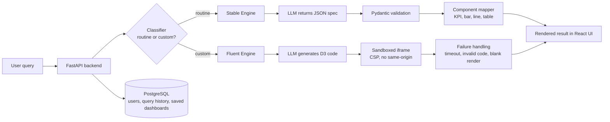

<h1 align="center">MorphUI</h1>

<p align="center">
  <b>A hybrid generative-UI framework for analytics.</b><br>
  Routine questions get vetted components. Unusual questions get generated code, run in a sandbox.
</p>

<p align="center">
  
  
  
  
  
  
</p>

> 🚧 **Early development.** This README describes the target design. Items marked ⬜ are not built yet, and every number in the results tables is empty until I have measured it. I update this file as each part lands.

<!-- Add a live-demo link and a CI badge here once they exist. Delete this comment then. -->

---

## What is MorphUI?

You type a question about your data. MorphUI decides **how** to answer it:

| You ask | MorphUI does | Engine |
|---|---|---|
| "Show sales by category" | Asks an LLM for a small JSON spec and renders a pre-built, tested chart component | **Stable Engine** |
| "Heatmap of sales by region and month, highlight the weakest quarter" | Asks an LLM to write D3 code and runs it in a locked-down iframe | **Fluent Engine** |

A **classifier** reads each query and a **router** sends it to the right engine.

### Why hybrid?

This is the hypothesis the project tests, not a result:

- Routine queries are cheaper, faster and more predictable when the LLM only fills in a spec for components I've already tested.
- Custom queries can't be covered by a fixed component set, so they need generated code, which is slower, less reliable and riskier.
- Sending each query to the right engine should beat using either engine alone.

The [evaluation](#evaluation) is designed to confirm or refute this, including where it fails.

---

## Architecture



**Classifier**
- v1: rules and keyword heuristics
- v2: LLM-based, compared against v1 with numbers

---

## Features and status

| Area | Feature | Status |
|---|---|---|
| Backend | FastAPI skeleton, Pydantic models | ⬜ |
| Backend | JWT register and login | ⬜ |
| Data | PostgreSQL with users, query history and saved dashboards | ⬜ |
| Stable Engine | LLM returns a validated JSON spec | ⬜ |
| Stable Engine | 4-5 vetted components (KPI card, bar chart, line chart, table) | ⬜ |
| Fluent Engine | LLM-generated D3 code in a sandboxed iframe | ⬜ |
| Fluent Engine | Handling for timeouts, invalid code and blank renders | ⬜ |
| Routing | Rule-based classifier (v1) and router | ⬜ |
| Routing | LLM-based classifier (v2) | ⬜ |
| Frontend | React app: login, query box, results, saved dashboards | ⬜ |
| Quality | pytest suite, GitHub Actions CI | ⬜ |
| Quality | Evaluation harness and adversarial security tests | ⬜ |
| Delivery | Docker Compose setup and public deployment | ⬜ |

Scope for the first version: **one dataset, 4-5 stable components, one Fluent Engine path.** No CSV upload and no multi-user sharing until the evaluation is done.

---

## Tech stack

| Layer | Tools |
|---|---|
| Backend | Python 3.12+, FastAPI, SQLAlchemy, Alembic, Pydantic, JWT |
| Database | PostgreSQL |
| Frontend | React (Vite), Tailwind CSS, shadcn/ui, Recharts |
| Generated charts | D3.js in a sandboxed iframe |
| Evaluation | Plain Python scripts, so results are reproducible |
| Infra | Docker, Docker Compose, GitHub Actions |

---

## Security model

Generated code is untrusted. MorphUI treats it that way:

- Runs inside an `<iframe sandbox="allow-scripts">` **without** `allow-same-origin`, so it can't read the parent page's cookies or storage.
- Gets its data through `postMessage` only.
- A strict Content-Security-Policy blocks outbound network requests.
- Is checked for timeouts, invalid code and blank renders before anything is shown.

**The sandbox is a layer of defence, not a guarantee.** I call it *sandboxed*, not *secure*. The claim rests on a set of adversarial prompts (see [Evaluation](#evaluation)) that try to call external URLs, read cookies and reach the parent page.

---

## Evaluation

Results are filled in only after I run the experiments.

**Setup**
- **Query set:** 40-50 queries, each labelled *routine* or *custom* by hand.
- **Configurations compared:** (a) Stable-only, (b) Fluent-only, (c) MorphUI hybrid.
- **Classifier:** rule-based v1 vs LLM-based v2.
- **Security:** 15-20 adversarial prompts.
- **Code:** everything lives in `eval/` and runs as a Python script.

**Results: engines** *(not measured yet)*

| Configuration | Render success | Median latency | p95 latency | Failure rate |
|---|---|---|---|---|
| Stable-only | — | — | — | — |
| Fluent-only | — | — | — | — |
| MorphUI hybrid | — | — | — | — |

**Results: classifier** *(not measured yet)*

| Classifier | Accuracy |
|---|---|
| Rules (v1) | — |
| LLM (v2) | — |

**Results: security** *(not measured yet)*

| Adversarial prompts | Blocked |
|---|---|
| — | — / — |

---

## Getting started

> Not runnable yet. This section will hold the real commands once the Docker Compose setup works.

Planned flow:

```bash
git clone https://github.com/vaibhavbarate22/morphui.git
cd morphui
cp .env.example .env      # add your LLM provider settings
docker compose up
```

---

## Planned project layout

```
morphui/
├── backend/        # FastAPI app, models, routers, engines, classifier
├── frontend/       # React (Vite) app
├── eval/           # query set, evaluation scripts, results
├── docker-compose.yml
└── README.md
```

---

## Known limitations

These are design-time limits that I expect to keep:

- Single dataset, no user uploads.
- LLM output varies between runs, so reported numbers come from repeated runs on a fixed query set.
- Free-tier LLM and hosting limits affect latency and availability.
- A hand-written query set of 40-50 queries is small. Treat results as indicative, not statistically conclusive.
- The rule-based classifier will be brittle on phrasing it hasn't seen.
- The sandbox reduces risk but does not remove it.

I'll add measured limitations here after the evaluation.

---

## Roadmap

- [ ] Backend skeleton with auth and database
- [ ] Stable Engine v1
- [ ] Fluent Engine with sandbox
- [ ] Classifier v1 and router
- [ ] Deployed MVP
- [ ] Evaluation, adversarial tests and write-up
- [ ] Classifier v2 (LLM-based)

---

## Author

**Vaibhav Barate**, final-year B.E. Computer Engineering student, Pune.

[GitHub](https://github.com/vaibhavbarate22) · [LinkedIn](https://www.linkedin.com/in/vaibhavbarate22)
=======
# Hi, I'm Vaibhav 👋

Final-year B.E. Computer Engineering student (Expected 2027) at KJ College of Engineering and Management, Pune.

I'm building full-stack Python applications with LLM features, and I'm looking for entry-level **Python Developer**, **Backend (Python)** or **Full Stack Python** roles.

## What I'm working on

- **MorphUI** (in progress): a hybrid generative-UI framework for analytics. Routine queries go to a set of vetted chart components, and unusual queries go to LLM-generated D3 code that runs in a sandboxed iframe. I'm measuring it against single-engine baselines and will publish the numbers, including where it fails. <!-- Add the repo link here only after the repo has real code. Delete this whole bullet until then. -->
- Weekly practice: SQL, pytest and DSA problems, committed to my repos with notes.

## Skills

**Working knowledge:** Python, FastAPI, HTML, RAG, PostgreSQL, SQLAlchemy, JWT auth, Docker, React, pytest

## Contact

- LinkedIn: [linkedin.com/in/vaibhavbarate22](https://www.linkedin.com/in/vaibhavbarate22)
- Email: (vaibhavbarate7@gmail.com)
>>>>>>> 3dcff9a251c81d1daeda362854c5b354e3261074
